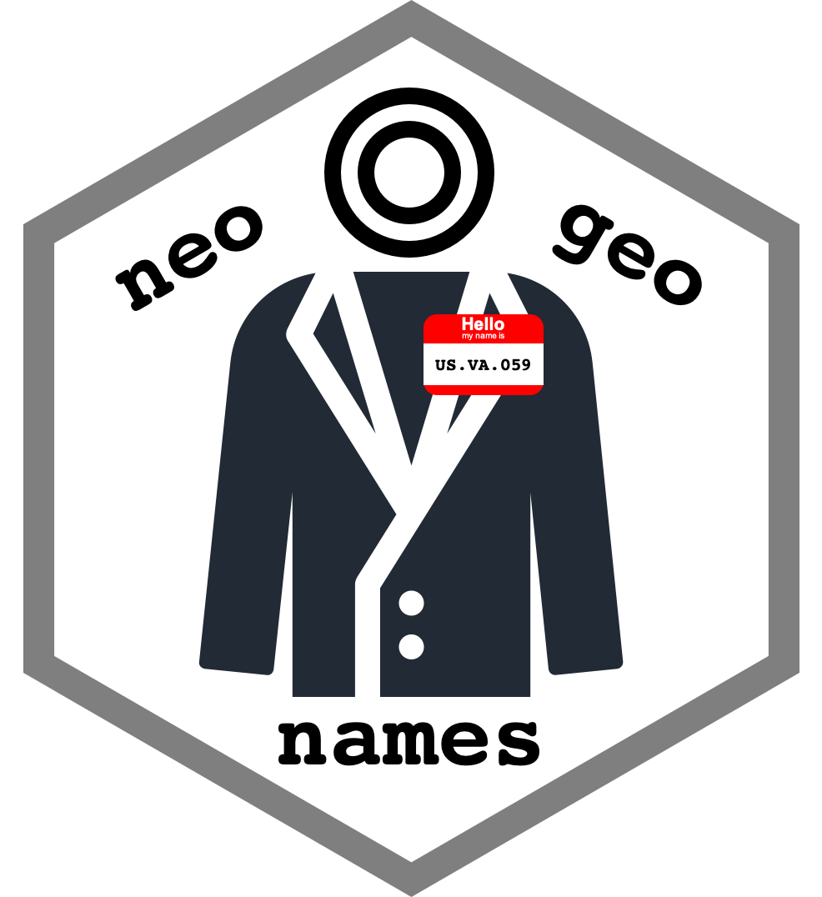

<!-- README.md is generated from README.Rmd. Please edit that file -->

```{r, include=FALSE}
knitr::opts_chunk$set(
  collapse = TRUE,
  comment = "#>",
  fig.path = "man/figures",
  out.width = "100%"
)
```

# neogeonames 

<!-- badges: start -->
[](https://github.com/dnanto/neogeonames/blob/master/LICENSE)
[](https://github.com/dnanto/neogeonames)
[](https://github.com/dnanto/neogeonames/actions)
<!-- badges: end -->

The goal of neogeonames is to provide a useful subset of the 
[GeoNames Gazetteer Data](http://download.geonames.org/export/dump/) with functions to infer 
[ISO3166](https://en.wikipedia.org/wiki/ISO_3166) codes for place
name queries in a hierarchical manner without a REST API. This package also includes coordinates and shape data for plotting maps, language codes, and timezone data.

## Installation

You can install the development version from [GitHub](https://github.com/) with:

``` r
# install.packages("devtools")
devtools::install_github("dnanto/neogeonames")
```

## Example

This is a basic example which shows you how to standardize potentially misspelled place name into 
a set of ISO3166 codes.

```{r}
library(neogeonames)
geo <- neogeonames::adminify_delim("USA: Fairfax County, Virginia", delim = "[:,]")
geo
paste(Filter(Negate(is.na), geo$ac), collapse = ".")
```

Here's another example with misspelled name...

```{r}
geo <- neogeonames::adminify_delim("USA: Furfax County, Virginia", delim = "[:,]")
geo
```

Use the geonameid to get the coordinates.

```{r}
# get the id that occurs before the first NA value
idx <- which(is.na(c(geo$id, NA)))[[1]] - 1
with(geoname, geoname[geonameid == geo$id[idx], c("longitude", "latitude")])
```

Here's another example using regular expressions...

```{r}
adminify_regex(
  "USA: Furfax County, Virginia",
  list(pattern = "(.+):\\s*(.+)\\s*,\\s*(.+)", names = c("ac0", "ac2", "ac1"))
)
```

Plot all feature codes in the US state of Virginia.

```{r, fig.width=10, fig.height=4}
library(ggplot2)
df.virginia <- with(geoname, geoname[which(country_code == "US" & admin1_code == "VA"), ])
ggplot(df.virginia, aes(longitude, latitude)) + 
  geom_point(aes(fill = feature_code), pch = 21, size = 2, alpha = 0.75) + 
  guides(fill = guide_legend(nrow = 1)) +
  coord_map() +
  theme_minimal() +
  theme(legend.position = "bottom")
```

Plot all world capitals.

```{r, fig.width=10, fig.height=4}
df.capital <- with(geoname, geoname[which(feature_code == "PPLC"), ])
ggplot() + 
  geom_polygon(
    data = shape, color = "black", fill = "white",
    aes(long, lat, group = group)
  ) +
  geom_point(
    data = df.capital, fill = "blue", pch = 21,
    aes(longitude, latitude)
  ) +
  coord_map() +
  theme_minimal()
```


Also, check out the `vignette("neogeonames")`.

## Data License

- [GeoNames Gazetteer Data License](https://creativecommons.org/licenses/by/4.0/)
