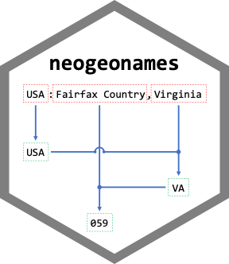

<!-- README.md is generated from README.Rmd. Please edit that file -->

```{r, include = FALSE}
knitr::opts_chunk$set(
  collapse = TRUE,
  comment = "#>",
  out.width = "100%"
)
```

# neogeonames

<!-- badges: start -->
<!-- badges: end -->



The goal of neogeonames is to provide a useful subset of the 
[GeoNames Gazetteer Data](http://download.geonames.org/export/dump/) with functions to infer 
[https://en.wikipedia.org/wiki/ISO_3166](https://en.wikipedia.org/wiki/ISO_3166) codes for place
name queries in a hierarchical manner without a REST API.

## Installation

You can install the development version from [GitHub](https://github.com/) with:

``` r
# install.packages("devtools")
devtools::install_github("dnanto/neogeonames")
```

## Example

This is a basic example which shows you how to standardize potentially misspelled place name into 
a set of ISO3166 codes.

```{r example}
library(neogeonames)
geo <- neogeonames::adminify("USA: Virginia, Fairfax County", delim = "[:,]")
geo
paste(Filter(Negate(is.na), geo$ac), collapse = ".")
```

Use the geonameid to get the coordinates.

```{r}
# get the id that occurs before the first NA value
idx <- which(is.na(c(geo$id, NA)))[[1]] - 1
with(geoname, geoname[geonameid == geo$id[idx], c("longitude", "latitude")])
```

Also, check out the `vignette("neogeonames")`.

## Data License

- [GeoNames Gazetteer Data License](https://creativecommons.org/licenses/by/4.0/)
